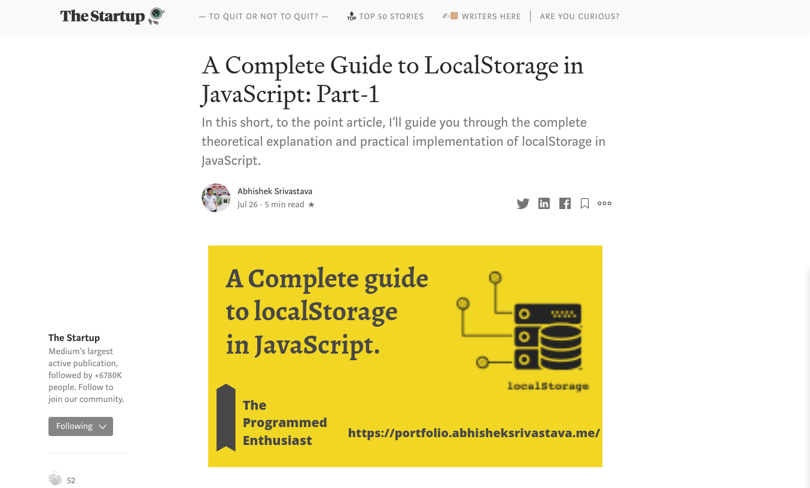
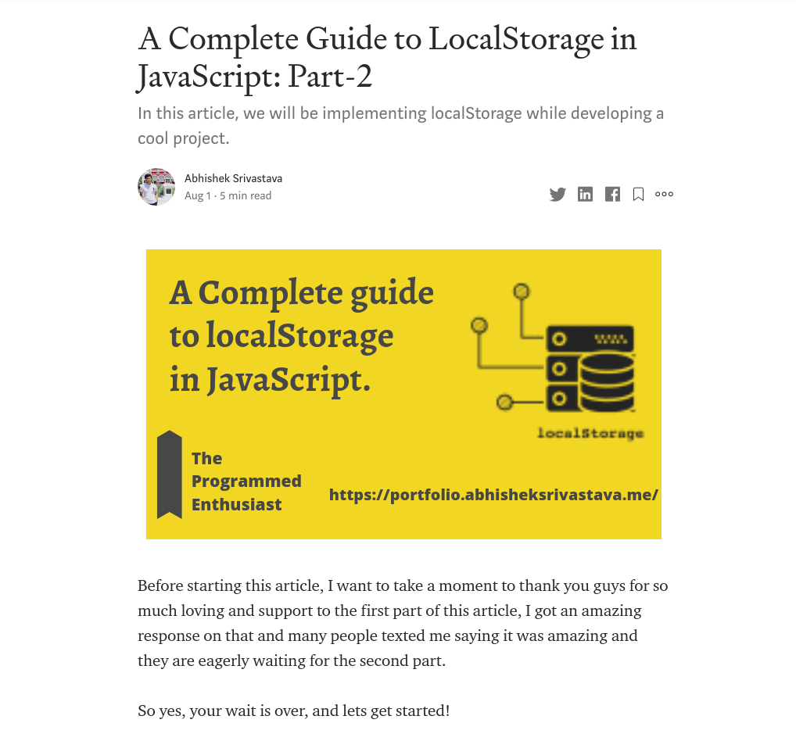

# A-Complete-Guide-to-LocalStorage-in-JavaScript

***localStorage is a type of web storage that allows JavaScript sites and apps to store and access data right in the browser with no expiration date. This means the data stored in the browser will persist even after the browser window has been closed. The stored data is saved across browser sessions.***

### This article is divided into into two parts:

* Part-1: Theoretical Explanation
* Part-2: Practical Implementation

</img>

***

## First Part
*The first part deal with the theoretical understanding and conceptual details of how to implement localStorage in JavaScript.*

## Link of the article: <a href="https://medium.com/swlh/a-complete-guide-to-localstorage-in-javascript-ef65098e5a36">Read Article</a>

</img>

***

## Second Part
*Now the second part covers the implementation and in-depth explanation of localStorage and we also develop a cool project together*

## Link of the article: <a href="https://medium.com/@abhishek2x/a-complete-guide-to-localstorage-in-javascript-part-2-115ecae5e00c">Read Article</a>

</img>

***

# Final Result: 

***If you followed along with me through this whole tutorial, you should have a really good feel for localStorage now. To summarize, we have divided the article into two parts. The first part deal with the theoretical understanding and conceptual details of how to implement localStorage in JavaScript. The second part(this article) covers the implementation and in-depth explanation of localStorage and also develop a cool project.***

*This article should have given you a good understanding of localStorage in JavaScript. There is much more to learn and improve, but I hope you feel confident delving in and playing around with localStorage yourself now.*

</img>

***
